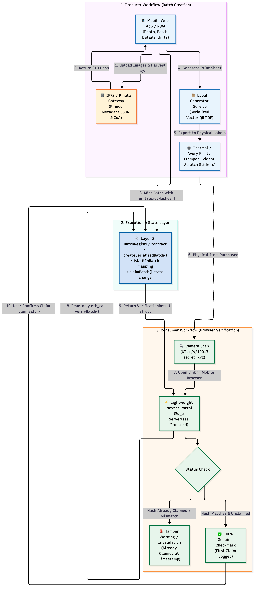

# 📦 BatchSnap | Web3 Provenance Studio

[](https://github.com/moeketsi200/BatchSnap/actions/workflows/build-and-slsa.yml)
[](https://nextjs.org)
[](https://prisma.io)

> **No-code batch provenance and anti-counterfeit label generator for artisanal producers.**  
> Create immutable product records, anchor them securely, and generate print-ready cryptographic labels in under 60 seconds.



## 📌 Problem & Vision

Small producers (coffee roasters, honey harvesters, olive oil estates) face growing threats from counterfeiters and gray-market dilution. Enterprise traceability systems are too expensive and complex.

**BatchSnap** solves this with a web-first, zero-overhead Web3 utility:
1. **Producer Side:** Enter key attributes, generate a cryptographic batch, and immediately export serialized, print-ready QR label sheets directly from the browser.
2. **Consumer Side:** Scan a tamper-evident QR code with any standard smartphone camera to verify authenticity and origin—no Web3 wallet, app download, or gas fees required.

---

## ✨ Features & Upgrades

- **No-Code Studio:** A gorgeous Glassmorphism UI tailored for field use. Takes less than a minute on a mobile or desktop screen.
- **SQLite / Prisma Backend:** Seamlessly simulates Layer 2 blockchain state and IPFS pinning using a blazingly fast local SQLite database.
- **Print-Ready CSS Export:** Uses advanced Tailwind `print:` modifiers to automatically compile serialized QR codes into standard Avery label templates (e.g. 5160, 5163) for immediate inkjet printing.
- **Optics-Optimized QR Codes:** Camera-optimized SVG QR matrices with **Lucide vector emblem** overlays and highly scannable color contrasting. 
- **Single-Claim Anti-Counterfeiting:** Detects duplicate scans instantly. If a bad actor prints 50 copies of a single QR code, the first scan claims the genuine token and subsequent scans flash a 🚨 Tamper Warning.
- **Secure CI/CD (SLSA3):** Comes pre-configured with GitHub Actions for automated Webpack building, SLSA Level 3 supply-chain provenance generation, and Datadog Synthetics testing.

---

## 🏗️ Architecture & Workflow

BatchSnap operates in three seamless phases:

1. **Producer Workflow:** The maker inputs harvest data. The backend generates a primary IPFS payload and creates uniquely hashed cryptographic secrets for every single jar/bottle in the batch.
2. **Ledger Layer:** The batch is anchored (simulated via Prisma SQLite) using the `keccak256` hashes of the secrets. 
3. **Consumer Workflow:** A buyer scans the physical label. The edge-hosted Next.js portal performs a read-only check against the ledger. The first scan locks the item state to "Claimed", rendering counterfeit clones useless.

---

## 🚀 Tech Stack

- **Framework:** Next.js 15 (App Router)
- **Styling:** Tailwind CSS (Dark Mode, Glassmorphism, Print Media Queries)
- **Database & ORM:** Prisma + SQLite
- **Cryptography:** Node.js `crypto` (Ethereum-compatible Keccak-256)
- **CI/CD:** GitHub Actions (SLSA Generic Generator)

---

## 📂 Repository Structure

```text
BatchSnap/
├── web/                   # Next.js Application Root
│   ├── prisma/
│   │   ├── schema.prisma  # SQLite Relational Schema
│   │   └── dev.db         # Local database state
│   ├── src/
│   │   ├── app/
│   │   │   ├── (producer)/# Producer Web3 Studio & Dashboard
│   │   │   ├── api/       # Next.js Route Handlers (DB/IPFS)
│   │   │   └── v/[id]/    # Consumer Verification Screen
│   │   ├── components/    # Reusable UI & Label Renderers (PrintableLabelSheet)
│   │   └── lib/           # Prisma Client, Crypto, & Service Logic
├── .github/workflows/     # CI/CD Pipelines
└── README.md
```

---

## ⚙️ Quickstart (Local Development)

### Prerequisites
- Node.js >= 20.x

### 1. Clone the repository

```bash
git clone git@github.com:moeketsi200/BatchSnap.git
cd BatchSnap
```

### 2. Database Initialization

The app uses Prisma and SQLite for zero-config local development. Navigate to the `web` folder and push the schema:

```bash
cd web
npm install
npx prisma db push
```

### 3. Run the Development Server

```bash
npm run dev
```

Navigate to [http://localhost:3000](http://localhost:3000) (or your local network IP) to access the Producer Dashboard.

> **💡 Network Scanning Tip:** If you want to test the physical QR code scanning with your phone, make sure you access the development server on your computer using your local network IP (e.g. `http://192.168.1.x:3000`). The Next.js frontend will dynamically bind that IP into the QR codes so your phone can reach it!

---

## 🛡️ Anti-Counterfeit Verification Logic

Each printed label encodes a URL with two parameters:

```text
http://<your-domain>/v/1001?secret=070fa1f5
```

When the consumer scans the item, the API performs a transaction:
- **First Scan:** ✅ Green Checkmark (*"100% Genuine"*). The underlying database updates the unit's timestamp to `claimedAt: <now>`.
- **Subsequent Scans:** 🚨 Red Warning (*"This code was already verified on [Timestamp]. Possible duplicate."*). Counterfeits are instantly identified.

---

## 🧪 Testing

The backend logic and simulated blockchain state transitions are thoroughly unit-tested. To run the suite:

```bash
cd web
npx tsx src/lib/__tests__/backend.test.ts
```

*(Note: Ensure your database is synchronized before running tests, as the suite resets local state).*

---

## 📜 License

Distributed under the MIT License.
